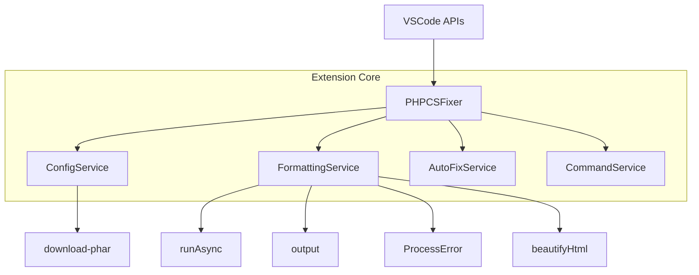

****---
name: php-cs-fixer-extension-refactor-and-test-focus
overview: Refine the vscode-php-cs-fixer extension architecture, improve separation of concerns, and realign tests to focus on extension responsibilities rather than php-cs-fixer internals.
todos:
  - id: arch-docs
    content: Document current and target architecture for the extension, clarifying extension vs php-cs-fixer responsibilities.
    status: pending
  - id: refactor-structure
    content: Refactor PHPCSFixer responsibilities into ConfigService, FormattingService, AutoFixService, and slimmer activate() wiring in extension.ts.
    status: pending
    dependencies:
      - arch-docs
  - id: cleanup-logic
    content: Remove dead/commented code, centralize platform-specific logic, and standardize error handling across formatting methods.
    status: pending
    dependencies:
      - refactor-structure
  - id: realign-tests
    content: Adjust existing tests to focus on extension responsibilities, remove php-cs-fixer-behavior tests, and add missing tests for update checking, errorTip, and workspace edge cases.
    status: pending
    dependencies:
      - refactor-structure
  - id: coverage-review
    content: Review coverage and behavior after refactors to ensure extension-specific logic remains well tested and stable.
    status: pending
    dependencies:
      - realign-tests
  - id: config-schema
    content: Introduce a typed ConfigSchema with centralized defaults and a single resolution pipeline (workspace/expressions/platform). Export helpers for expression resolution.
    status: pending
    dependencies:
      - refactor-structure
      - arch-docs
  - id: helper-extractions
    content: Extract reusable helpers (buildSpawnOptions, ensureExecutable, quoteArgForPlatform) and use them across services to remove duplication.
    status: pending
    dependencies:
      - refactor-structure
      - cleanup-logic
  - id: concurrency-guard
    content: Replace global isRunning with a FormattingService-level concurrency guard; ensure re-entrancy rules are clear and tested.
    status: pending
    dependencies:
      - refactor-structure
  - id: beautify-policy
    content: Decide and document whether beautifyHtml is core or optional; if optional, lazy-load behind a feature flag; update tests accordingly.
    status: pending
    dependencies:
      - arch-docs
      - refactor-structure
  - id: activation-integration-tests
    content: Add light integration tests for activate() wiring (commands, events, providers registered based on settings) using VSCode mocks.
    status: pending
    dependencies:
      - realign-tests
  - id: slow-integration-phpcs
    content: Add an optional slow integration test that runs real php-cs-fixer end-to-end (gated by env var like RUN_SLOW=1); document prerequisites.
    status: pending
    dependencies:
      - realign-tests
  - id: logging-standardize
    content: Unify logging and error surfacing through output.ts; ensure errorTip and ProcessError mapping are consistent across services.
    status: pending
    dependencies:
      - cleanup-logic
  - id: multi-root-fixtures
    content: Create multi-root workspace fixtures to exercise resolveVscodeExpressions/getActiveWorkspaceFolder edge cases in tests.
    status: pending
    dependencies:
      - realign-tests
  - id: ci-gating
    content: Update CI to run unit tests by default and gate slow/integration tests via environment variables; add npm scripts (test:unit, test:integration, test:slow).
    status: pending
    dependencies:
      - slow-integration-phpcs
      - activation-integration-tests
  - id: docs-readme
    content: Update README with responsibilities matrix (extension vs php-cs-fixer), how config is resolved, and how tests are scoped and run (including slow tests).
    status: pending
    dependencies:
      - arch-docs
      - ci-gating
  - id: download-command
    content: Provide/verify a command to force download/update the php-cs-fixer phar (e.g., php-cs-fixer.downloadPhar) and cover with tests.
    status: pending
    dependencies:
      - refactor-structure
---

# PHP CS Fixer VSCode Extension – Refactor & Test Focus Plan

### Overview diagram

## 1. Clarify architecture and responsibilities

- **Document current architecture**
  - Summarize the roles of `PHPCSFixer` and supporting modules (`runAsync.ts`, `output.ts`, `beautifyHtml.ts`, `download-phar.ts`, `shared/processError.ts`) in `TEST_PLAN.md` or a short `ARCHITECTURE.md`.
  - Capture extension responsibilities vs php-cs-fixer responsibilities explicitly (what we own vs what the CLI owns).
  - Add a responsibilities matrix to README with concrete examples (what we test vs what php-cs-fixer tests).

- **Define target responsibilities**
  - Specify clear boundaries for: configuration loading, expression/workspace resolution, argument building, formatting/auto-fix orchestration, VSCode integration (events/commands/providers), and update/error utilities.
  - Use those boundaries as the basis for refactors and for deciding what tests should cover.
  - Introduce a typed `ConfigSchema` and a single resolution pipeline that applies defaults, user settings, VSCode expressions, and platform rules deterministically.

## 2. Restructure `PHPCSFixer` into focused services

- **Extract configuration concerns**
  - Create a `ConfigService` (or similar) module to encapsulate `loadSettings()`, `resolveVscodeExpressions()`, and `getActiveWorkspaceFolder()` behavior.
  - Move platform-specific logic (Windows defaults, `.phar` handling, `${workspaceFolder}`/`${extensionPath}`/`~/` resolution) into this service, returning a well-typed config object.
  - Centralize defaults and validation via `ConfigSchema`, exporting a utility to surface effective config for diagnostics.

- **Extract formatting orchestration**
  - Introduce a `FormattingService` responsible for:
    - Temp file creation/cleanup (encapsulating use of `TEMP_DIR`, `HOME_DIR`, `tmpDir` and `fs.mkdirSync`/`fs.rm`).
    - Building arguments via `getArgs()` (potentially moved or wrapped here).
    - Invoking `runAsync()` and interpreting php-cs-fixer’s JSON output.
    - Mapping `ProcessError` exit codes to high-level error states/messages.
    - Implement an internal concurrency guard to prevent overlapping runs and to define queue/drop behavior explicitly.

- **Extract auto-fix behavior**
  - Create an `AutoFixService` (or just a module) exposing `doAutoFixByBracket()` and `doAutoFixBySemicolon()` using dependency injection for `format()` and VSCode APIs, so they can be tested in isolation.
  - Extract regex patterns into named constants and consider experiment branch with `php-parser` for more robust detection.

- **Extract command and event wiring**
  - Slim down `activate()` in `extension.ts` to be a composition layer:
    - Instantiate services.
    - Wire VSCode events (`onWillSaveTextDocument`, `onDidChangeTextDocument`, `onDidChangeConfiguration`).
    - Register commands (`php-cs-fixer.fix`, `fix2`, `diff`, `showOutput`).
  - Keep `PHPCSFixer` (if still needed) as a façade over these services or gradually remove it.
  - Optionally introduce a `CommandService` wrapper to register and test commands as a unit.

- **Eliminate global mutable state**
  - Replace module-level `isRunning` with an instance-level flag or a simple concurrency guard inside `FormattingService`.

## 3. Clean up and simplify logic

- **Remove or modernize commented-out/dead code**
  - Drop unused `fileAutoSave`-related comments and any other legacy branches that are no longer meaningful.
  - Fix minor logical oddities such as the `pharPath !== null` check (where `pharPath` is always a string).

- **Centralize platform-specific quirks**
  - Introduce a small helper for Windows-safe quoting of CLI arguments (used for both `--config` and `--rules`).
  - Ensure `runAsync` and argument building share a consistent cross-platform story.
  - Add `buildSpawnOptions()` (for env like `PHP_CS_FIXER_IGNORE_ENV`) and `ensureExecutable()` helpers, used by all execution paths.

- **Rationalize error handling**
  - Standardize on a pattern where public methods return rejected promises with proper Error objects (or typed error results), avoiding bare `reject()` calls.
  - Ensure `format()`, `formattingProvider()`, and `rangeFormattingProvider()` use consistent error signaling, making it easier to reason about behavior and write tests.
  - Route all user-facing errors through `errorTip()` with actionable guidance and an "Open Output" option.

- **Re-evaluate `beautifyHtml` coupling**
  - Decide whether HTML beautification is core or optional:
    - If core: document its behavior and keep it behind a simple interface.
    - If optional: consider lazy-loading or flagging it clearly so complexity is isolated.

## 4. Realign tests to focus on extension behavior

- **Keep tests that are clearly extension responsibilities**
  - Config loading defaults and overrides (`extension.loadSettings.test.ts`).
  - Expression and workspace resolution (`extension.expressions.test.ts`).
  - Argument construction for various configs and platforms (`extension.getArgs.test.ts`).
  - Exclusion logic and `anymatch` usage (`extension.isExcluded.test.ts`, plus formatting/auto-fix tests).
  - Formatting orchestration: temp files, partial vs full, diff mode, ENOENT handling (`extension.formatting.test.ts`).
  - Auto-fix semantics around bracket/semicolon triggers and early-return guards (`extension.autoFix.test.ts`).
  - Event and command wiring, including activation/deactivation (`extension.events.test.ts`, `extension.test.ts`).

- **Adjust or remove tests that are php-cs-fixer’s job**
  - Avoid asserting on the actual formatted PHP code; instead:
    - Mock `runAsync` to return “some formatted text” and assert that:
      - Temp file is read or not read based on `files.length`.
      - Returned value matches what the extension decides (original vs new text).
  - Avoid testing the exact JSON structure beyond what the extension consumes (e.g. just presence of `files.length`).
  - Avoid testing php-cs-fixer’s exit code semantics beyond mapping to our status messages.
  - Provide an optional slow e2e test (behind `RUN_SLOW=1`) that runs the real binary and only asserts on plumbing behaviors (spawned path/args and non-empty output), not rule-level formatting specifics.

- **Fill remaining test gaps**
  - Add targeted tests for:
    - `checkUpdate()` timing/conditions (using fake timers) and update of `lastDownload` only when appropriate.
    - `errorTip()` user flow (showErrorMessage with the right message, and that selecting \"Open Output\" calls our output channel).
    - More nuanced multi-root workspace cases for `resolveVscodeExpressions()` and `getActiveWorkspaceFolder()`.
    - Edge cases for `format()` error paths: JSON parse failures, ProcessError without exitCode, and ENOENT scenarios.
    - Activation wiring: providers/commands registration based on settings toggles, with negative cases covered.
    - Download phar command behavior (manual trigger), if implemented.

## 5. Testing strategy and coverage goals

- **Unit tests on extracted services**
  - After refactors, target each new service with focused unit tests that:
    - Use dependency injection for collaborators (`runAsync`, `fs`, `vscode`) to avoid heavy mocking.
    - Test only extension-specific behavior: arguments, decisions, integration points.

- **Integration-style tests for `activate()`**
  - Keep lean integration tests that:
    - Verify commands/events/providers are registered based on configuration.
    - Ensure subscriptions are wired correctly into the VSCode `ExtensionContext`.
  - Provide npm scripts to run unit-only vs integration/slow tests; document in README and CI.

- **Coverage focus**
  - Maintain or improve current coverage while shifting emphasis away from php-cs-fixer internals and toward extension behavior.
  - Prioritize branches around configuration, path resolution, exclusions, and auto-fix decisions over exhaustive CLI output content.

## 6. Developer workflow and CI

- Add npm scripts:
  - `test:unit` – fast unit suite
  - `test:integration` – VSCode activation wiring
  - `test:slow` – real php-cs-fixer e2e; gated by `RUN_SLOW=1`
- Update CI to run unit tests by default; run slow suite only on demand (manual dispatch or nightly).
- Cache php-cs-fixer phar between CI runs to reduce flakiness for slow tests.

## 7. Documentation updates

- Create `ARCHITECTURE.md` summarizing current vs target architecture, service boundaries, and data flow.
- Extend README with:
  - Responsibilities matrix (extension vs php-cs-fixer)
  - Configuration resolution order and examples
  - How to run tests (unit, integration, slow) and required prerequisites
  - How to trigger manual download/update of php-cs-fixer (if command is added)

